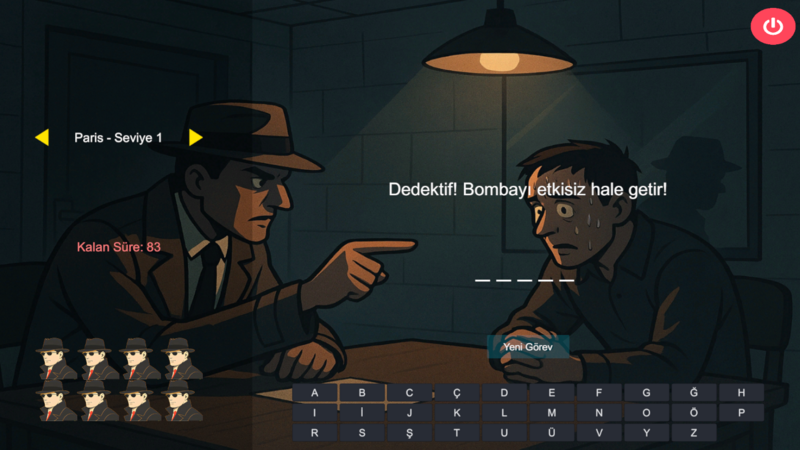

# DeBomb

**DeBomb**, oyuncunun kelime tahmin ederek bir şehri kurtarmaya çalıştığı gerilimli bir oyun.  

## Konsept
- Yanlış tahminler şehri ve bombayı tehlikeye sokar.  
- Amaç kelimeleri doğru tahmin ederek şehri ve bombayı güvenli hale getirmek.  
- Klasik "Adam Asmaca" oyununa modern bir gerilim ve mekanik eklenmiştir.  

## Proje Yapısı
- **Assets/** : Oyunun sahneleri, scriptleri ve görselleri.  
- **ProjectSettings/** : Unity proje ayarları.  

## Kurulum
1. Unity Hub üzerinden uygun Unity sürümünü açın.  
2. Projeyi klonlayın veya indirin.  
3. Unity Hub üzerinden proje klasörünü açın ve sahneleri çalıştırın.  

## Lisans
Bu proje MIT lisansı ile paylaşılmıştır. Detaylar LICENSE dosyasında.
